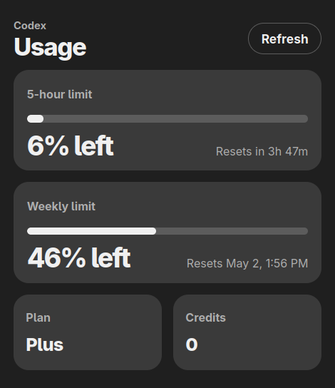

# Codex Usage Viewer

**A tiny browser extension that shows your Codex usage from ChatGPT.**

[MIT License](LICENSE)

## Shows

- 5-hour usage left
- Weekly usage left
- Plan
- Credits
- Reset times

## Install In Firefox

1. Open `about:debugging#/runtime/this-firefox`.
2. Click `Load Temporary Add-on...`.
3. Select `manifest.json`.

Firefox removes temporary add-ons when it restarts.

## Use

1. Sign in to ChatGPT in the same Firefox profile.
2. Click the extension icon. It refreshes automatically.
3. Click `Refresh` to retry manually.

## Notes

- Calls `https://chatgpt.com/api/auth/session` and `https://chatgpt.com/backend-api/wham/usage`.
- Stores only the latest parsed usage snapshot in extension storage.
- Does not request the browser cookies permission. Requests to `chatgpt.com` still use your existing ChatGPT session.
